# 머신러닝

**학습**

1. [AI / 머신러닝 개요](#01-ai--머신러닝-개요)
2. [분류 (Classification)](#02-분류-classification)
3. [회귀 (Regression)](#03-회귀-regression)
4. [추천 시스템](#04-추천-시스템)

**실습**

5. [심장병 예측 — 분류](#05-심장병-예측--분류)
6. [배송 시간 예측 — 회귀](#06-배송-시간-예측--회귀)

---

# 학습

## 01. AI / 머신러닝 개요

| 구분 | Rule-based AI | Machine Learning AI |
|------|---------------|---------------------|
| 규칙 생성 | 전문가가 직접 `if-then` 정의 | 데이터에서 패턴을 학습해 자동 생성 |
| 투명성 | 높음 (명시적) | 낮음 (블랙박스) |
| 한계 | 모호한 상황에 취약 | 데이터 품질에 의존 (Garbage In, Garbage Out) |

**학습 유형**

- **지도 학습**: 문제(Feature) + 정답(Target) → 분류, 회귀
- **비지도 학습**: 문제(Feature)만 → 군집화, 차원 축소
- **강화 학습**: 보상/벌점 신호 → 보상 최대화 정책 학습


## 02. 분류 (Classification)

문제와 정답을 학습한 뒤 새로운 문제의 정답을 예측한다. (이진 분류 / 다중 분류)

### 결정 트리 (Decision Tree)

- 데이터의 규칙을 자동으로 찾아 트리 기반 분류 규칙을 만든다. 특성을 개별 처리해 **스케일 영향을 받지 않아** 정규화/표준화가 거의 필요 없다.
- 목적은 **불순도(Impurity) 감소** — 수치화한 값이 **지니 계수**(0~1, 낮을수록 잘 분류). 성능을 과하게 높이면 **과적합**.

| 하이퍼파라미터 | 역할 |
|----------------|------|
| `max_depth` | 트리 최대 깊이 (과적합 시 단순화) |
| `min_samples_split` / `min_samples_leaf` | 분할/리프 최소 샘플 수 (과적합 방지) |
| `max_features` | 분할 시 고려할 feature 수 |
| `class_weight` | 클래스 불균형 시 가중치 (`balanced`) |

### 교차 검증 (Cross Validation)

학습 데이터를 다시 학습/검증으로 나눠 여러 번 검증해 정확도의 신뢰도를 높인다.

- **K-Fold** / **Stratified K-Fold**(폴드마다 타겟 분포 유지, 분류에서 권장)
- `cross_val_score` (간편) · `RandomizedSearchCV`(무작위 탐색, 빠름) · `GridSearchCV`(전수 탐색, 정밀)
- 전략: **Random Search로 넓게 → Grid Search로 정밀** 탐색.

### 분류 평가 지표

불균형 데이터에서는 정확도만으로 부족하다. **오차 행렬**(TN/FP/FN/TP)로 아래를 모두 구한다.

| 지표 | 정의 |
|------|------|
| 정밀도 (Precision) | Positive 예측 중 실제 Positive 비율 |
| 재현율 (Recall) | 실제 Positive 중 Positive로 예측한 비율 |
| F1 Score | 정밀도·재현율의 조화 평균 |
| ROC-AUC | ROC 곡선 아래 면적 (1에 가까울수록 좋음) |

- **임계값(Threshold) 트레이드오프**: 임계값을 낮추면 재현율↑, 높이면 정밀도↑. (`predict_proba` → `Binarizer` → `precision_recall_curve`)

### 나이브 베이즈 (Naive Bayes)

- **베이즈 추론**: `P(B|A)`로 정반대인 `P(A|B)`를 추론하는 역확률 문제. (예: 스팸에 그 단어가 나온 빈도로 그 단어가 있을 때 스팸일 확률을 역산)
- 텍스트 분류에 강하며 빠르다. 전제는 모든 feature의 독립.
- `MultinomialNB`(빈도) · `BernoulliNB`(등장 유무) · `GaussianNB`(연속형 수치).

## 03. 회귀 (Regression)

### 선형 회귀 (Linear Regression)

feature·target으로 학습해 최적의 회귀 계수(W)를 찾는다.

- **가설** `H(x) = Wx + b` (W 가중치/기울기, b 편향/절편)
- **손실 함수**: 오차를 구하는 함수. **MSE**(평균 제곱 오차)가 최소가 되는 W, b를 찾는다.
- **경사 하강법**: 기울기(미분값)가 0이 되는 지점으로 W를 점차 수정. **학습률(η)**로 속도 조절.
- **R²**: 평균이라는 기준점 대비 모델의 설명력.

### 다변량 선형 회귀 & 회귀 트리

- **다중 공선성**: 독립변수 간 강한 상관 문제 → **VIF**로 진단 (10 이상이면 변수 제거/결합).
- **회귀 트리**: 최종 분할 영역의 **타겟 평균값**으로 예측. 비선형 관계에 유리하나, 추세를 못 따라가고 극단값을 평균 쪽으로 끌어당기는 한계.

| 회귀 평가 지표 | 의미 |
|----------------|------|
| MAE / MSE / RMSE | 평균 절대·제곱·제곱근 오차 |
| MSLE / RMSLE | 로그 기반 오차 (오차의 비율) |
| R² | 평균 기준점 대비 설명력 |

## 04. 추천 시스템

- **콘텐츠 기반**: 텍스트(제목·태그·설명)를 벡터화하고 **코사인 유사도**로 비슷한 항목 추천.
- **벡터화**: `CountVectorizer`(빈도) vs `TfidfVectorizer`(TF×IDF로 흔한 단어 가중치를 깎고 변별력 있는 단어 강조).
- **협업 필터링**: 예상 평점 = (유사도 × 평점)의 합 / 유사도의 합.
- 한국어는 **Kiwi** 형태소 분석으로 조사·어미를 제거해 의미 단위 매칭을 높인다.

---

# 실습 (발표)

## 05. 심장병 예측 — 분류

`heart.csv`의 13개 feature(나이·성별·흉통유형·혈압·콜레스테롤·심전도·최대심박수·ST저하·지중해빈혈 등)로 **심장병 여부**를 예측한다. 의료 데이터이므로 **"환자를 놓치지 않는 것(재현율)"이 최우선 목표**다.

### 전처리 — 도메인 지식으로 함정 피하기

먼저 연속형 변수의 분포를 그려 이상치 처리 방식을 정했다.

```python
plt.hist(heart_df['콜레스테롤'], bins=40)   # 분포를 보고 표준화/IQR 결정
```

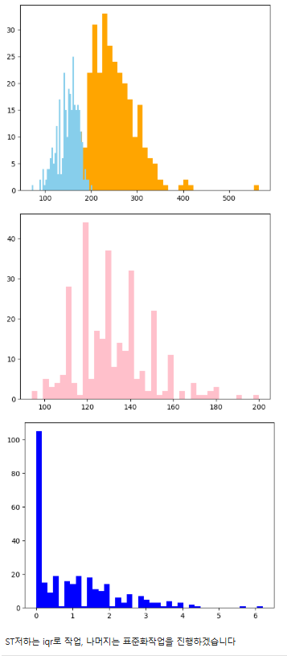

콜레스테롤·최대심박수·혈압은 `StandardScaler` 후 Z-score(±3)로, 한 컬럼이라도 벗어나면 제거했다.

```python
condition = (pre_heart_df[continuous_features] >= -3).all(axis=1) \
          & (pre_heart_df[continuous_features] <= 3).all(axis=1)
```

`ST저하`는 0이 많아 처음엔 결측처럼 평균으로 대체하려 했다. 그런데 원 컬럼명 `oldpeak`(운동 중 ST분절 하강)의 의미를 찾아보니 **0이 정상인의 범주**였다 — 병이 없으면 ST 하강이 없으니 당연히 0인 것. 평균으로 덮었다면 정상인 정보를 통째로 왜곡할 뻔했다. 그래서 0은 그대로 살리고 IQR로만 이상치를 정리했다. 범주형 5개는 OneHot으로 변환했다.

```python
chest_onehot = OneHotEncoder(sparse_output=False).fit_transform(heart_df[['흉통유형']])
```

### 1차 모델 → 과적합

```python
dtc = DecisionTreeClassifier(class_weight='balanced', random_state=124)
dtc.fit(X_train.values, y_train)
```

feature importance를 보니 모델이 소수 변수에 과도하게 의존하고 있었다 — 학습 데이터에 과하게 맞춰진 과적합 신호다.

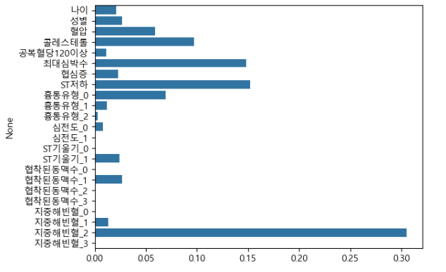

오차 행렬로 확인하니 **재현율 0.75 / 정밀도 0.73**. 실제 심장병 환자 32명 중 **8명(FN)을 정상으로 오판**했다. 환자 4명 중 1명을 놓치는 셈이라 의료용으로는 부족했다.

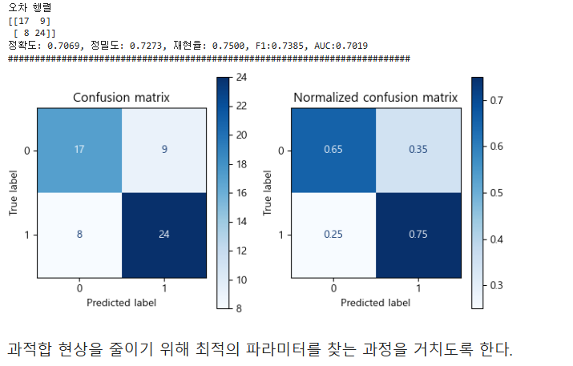

### 튜닝 → 재현율 끌어올리기

과적합을 줄이려 `RandomizedSearchCV`로 넓게 탐색한 뒤 `GridSearchCV`로 정밀 탐색했다.

```python
RandomizedSearchCV(dtc, {'max_depth': randint(2, 10),
                         'min_samples_split': randint(2, 20)}, n_iter=4, cv=5)
```

그 결과 **재현율 0.75 → 0.84**로 올라 **놓친 환자가 8명 → 5명**으로 줄었다.

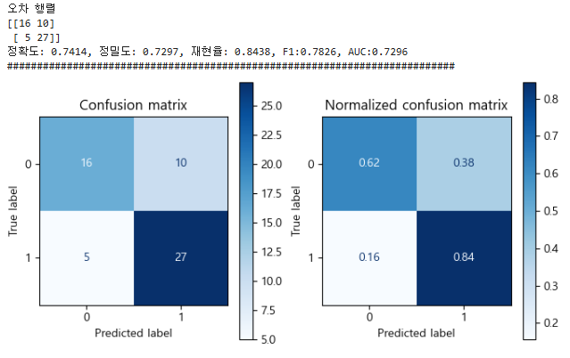

### 임계값 조정 → 균형 잡기

재현율을 높이니 이번엔 정밀도(오진)가 걸렸다. `precision_recall_curve`로 임계값별 trade-off를 눈으로 확인했다.

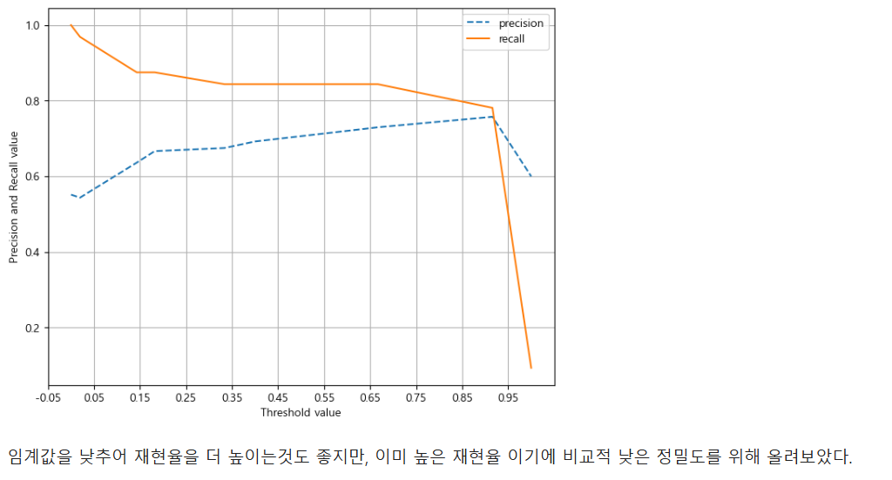

재현율은 이미 충분하다고 보고, 기준값을 직접 올려 정밀도를 되찾는 쪽을 택했다.

```python
proba = dtc.predict_proba(X_test.values)[:, 1]
prediction = Binarizer(threshold=0.91578947).fit_transform(proba.reshape(-1, 1))
```

**임계값을 0.916까지 올려 정밀도 0.73 → 0.76**으로 끌어올렸다. 재현율을 조금 양보(놓친 환자 5→7명)하는 대신 오진을 줄인 것으로, 한쪽을 끝까지 밀지 않고 **재현율 0.78 / 정밀도 0.76의 균형점**을 찾은 것이 이 분석의 핵심이다.

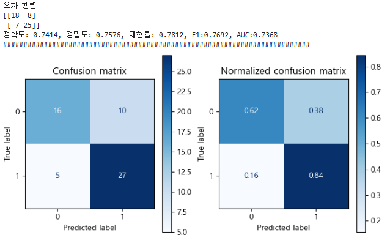

ROC 커브 위에 선택한 임계값(0.916) 지점을 함께 표시해, 이 모델이 FPR-TPR 곡선의 어디에서 동작하는지 확인했다.

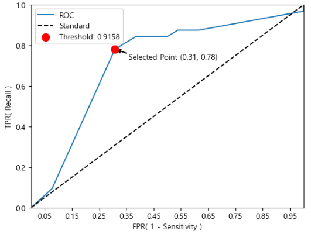

## 06. 배송 시간 예측 — 회귀

`07_delivery_time_prediction.csv`의 거리·교통·날씨·경유지·드라이버 경력 등으로 **배송 소요 시간(분)**을 예측한다.

### 전처리

`info`/`describe`/`isna`/`duplicated`로 점검하고, 도메인 지식으로 정보가 중복되는 컬럼을 먼저 덜어냈다.

```python
d_df.drop(['package_weight_kg', 'depart_hour', 'origin_type', 'dest_type'], axis=1, inplace=True)
```

상관 히트맵·히스토그램으로 분포를 보고, 전체 컬럼을 IQR로 정리한 뒤 VIF로 다중공선성을 점검했다.

```python
sns.heatmap(d_df.corr(), annot=True, fmt=".2f", cmap='coolwarm')
```

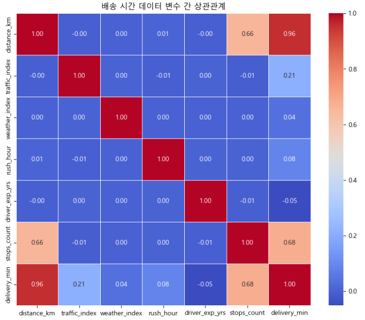
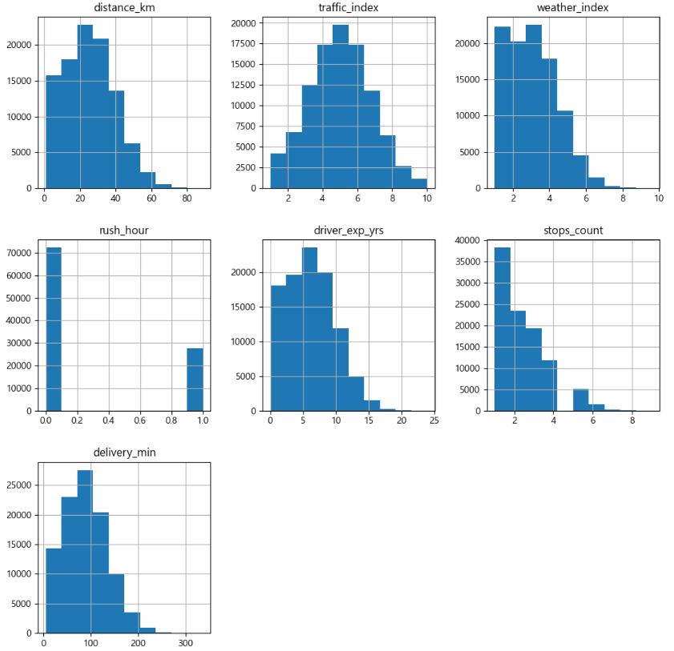

### 모델 비교 — 이미 충분히 선형이었다

baseline 선형회귀만으로 **R² 0.974**가 나왔다. 변수와 target이 거의 선형 관계였던 것.

```python
get_evaluation(y_test, np.maximum(l_r.predict(X_test), 0))   # 음수 예측 방지 → R² 0.974
```

그래도 트리·부스팅을 `log1p` 변환 후 비교했다. (압축 학습 → `expm1` 복원으로 RMSLE 안정화)

```python
y_train = np.log1p(y_train)
for model in [dt_reg, rf_reg, gb_reg, xgb_reg, lgb_reg]:
    model.fit(X_train, y_train)
    get_evaluation(y_test, np.expm1(model.predict(X_test)))
```

| 모델 | R² |
|------|-----|
| DecisionTree | 0.908 |
| RandomForest | 0.963 |
| GradientBoosting | 0.988 |
| **XGBoost / LightGBM** | **0.989** |

부스팅 계열이 근소하게 우수했다. 실제값(파랑)과 예측값(빨강)이 거의 겹쳐, 잔차도 0 근처에 좁게 모인다.

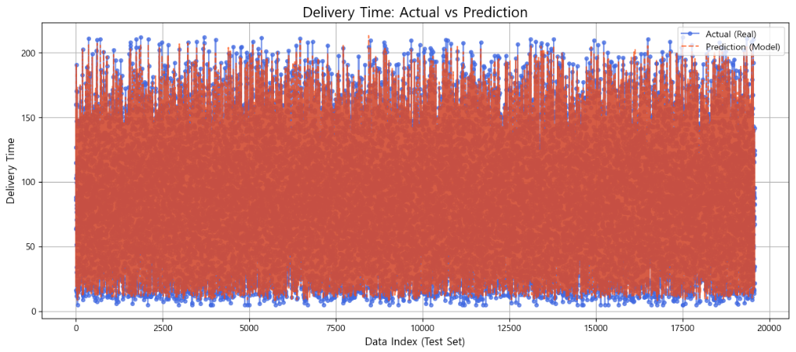
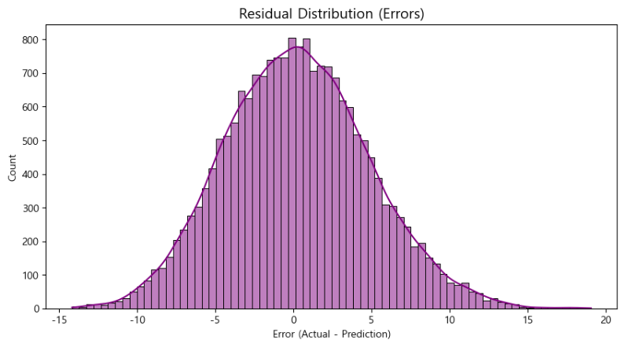

### Feature Engineering → 오히려 악화 (실패에서 배운 것)

성능을 더 끌어올리려 파생 변수를 만들었다 — 경유지당 거리, 거리×교통, 교통×날씨.

```python
pre1_d_df['dist_per_stop'] = d_df['distance_km'] / d_df['stops_count']   # 두 변수를 하나로
```

그런데 `distance_km`과 `stops_count`를 하나로 합치자 정보가 손실되어 **R²가 0.989 → 0.37로 폭락**했다. 합치기 전 두 변수가 각각 배송 시간을 설명하고 있었는데, 나누어 하나로 만들자 그 신호가 사라진 것이다. 게다가 거리×교통을 만들자 원본 변수와의 **VIF가 19**로 치솟아 다중공선성까지 생겼다.

```python
feature_engineering_VIF(features)   # 변수 합성 후 재확인 → VIF 19 (위험)
```

같은 Actual vs Prediction 그래프인데, 이번엔 예측(빨강)이 실제값을 따라가지 못하고 평균 근처로 뭉친다. 위의 잘 맞던 그래프와 비교하면 차이가 한눈에 보인다.

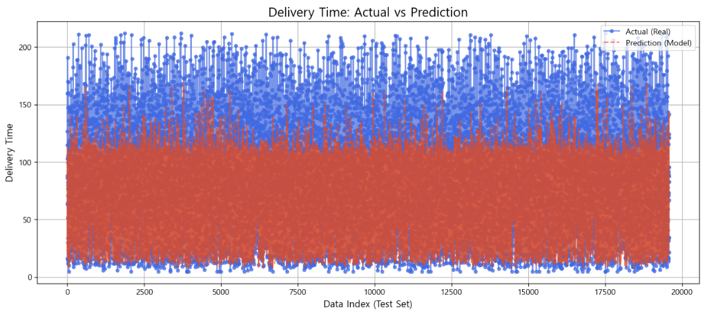
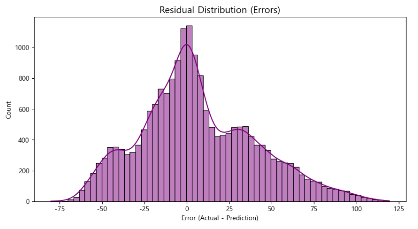

### 정리 (교훈)

- 선형회귀만으로 R² 0.9 이상 → 애초에 복잡한 변수 합성이 필요 없는 데이터였다.
- Feature Engineering은 신중하게 — 변수를 합치면 정보가 줄어 오히려 성능이 떨어질 수 있다.
- 변수 합성 후에는 **반드시 VIF로 다중공선성을 재확인**해야 한다.
- 과한 파생 변수를 정리하고 튜닝(Random → Grid Search)해 **R² 0.978**로 안정화했다.
